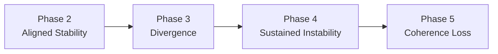

# BEAT Heartbeat (Conceptual)

The diagram below provides a **conceptual visualization** of the BEAT
(Behavioral–External Alignment Theory) heartbeat.

It illustrates how **internal strain** and **external capacity** evolve over
time and how their divergence corresponds to BEAT stability phases.

This figure is illustrative and non-empirical.

---

---

## Signal Interpretation (Conceptual)

### Internal Strain

- Low and stable in Phase 2  
- Increasing amplitude in Phase 3  
- Persistent and volatile in Phase 4  
- Overwhelms system constraints in Phase 5  

### External Capacity

- Synchronized with internal conditions in Phase 2  
- Lags internal strain in Phase 3  
- Erodes under sustained pressure in Phase 4  
- Fragments or collapses in Phase 5  

---

## Phase Logic

- Transitions are path-dependent  
- Reversal is possible but uncommon after Phase 4  
- Phase 5 is confirmatory, not predictive  

---

## Usage Notes

This visualization:

- Represents conceptual phase dynamics  
- Is intended for explanation and communication  
- Should not be interpreted as a forecast or time-to-collapse model  

Empirical heartbeat plots should be presented separately and explicitly labeled.

---
